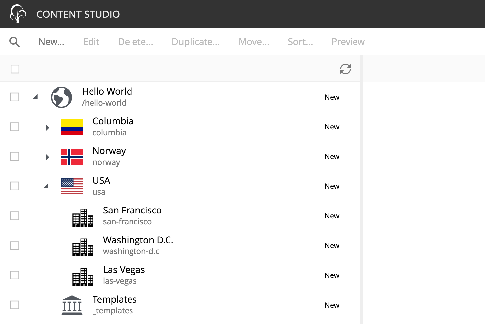
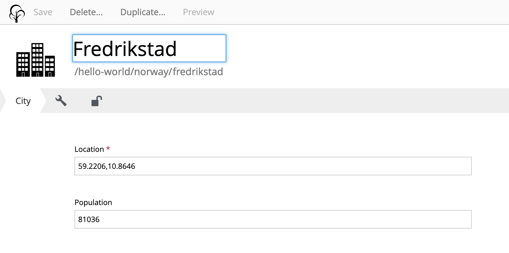

= My first website starter
:toc: right

A step-by-step tutorial for building your first website with Enonic XP

WARNING: This guide is under construction, do not use!

image::images/ready-set-code.jpg["Ready...Set...Code!", width=500px]

== Introduction

This guide will take you through the steps of creating a site, using the basic building blocks of Enonic XP.

During this exercise you will learn how to:

* create a new project based on this starter
* build content types
* work with page components and controllers
* use page templates
* TODO

== Create project

Visit the https://developer.enonic.com/start[Getting started guide] and complete the setup process.

Some hints to the process:

* Step 1: If you have already installed CLI, you may skip this step
* Step 2: Choose "My First Website" starter
* Step 3: Deploy and start the XP sandbox
* Wrapping up: Remember to install the apps from the Welcome tour, we will need some of them later on.

NOTE: If XP tour does not start automatically, simply click the top left icon on the home screen

You should now have an XP sandbox and the application running on http://localhost:8080

[NOTE]
====
To verify that your app started successfully, you should find an entry similar to this in the sandbox log:

  2019-04-09 13:40:40,765 INFO ... Application [<my.project.name>] installed successfully
====

The project folder created should now contain a project structure, looking something like this:

[source,files]
----
sample-../code-samples/ <!--1-->
docs/ <!--2-->
src/
  main/
    java/ <!--3-->
    resources/ <!--4-->
      import/ <!--5-->
      assets/
      services/
      sites/
        content-types/ <!--6-->
          country/
          city/
        site.xml <!--7-->
----

<1> Holds sample code we will use throughout this tutorial
<2> Contains the documentation you are reading now
<3> Optional folder for Java code (used to import sample site in this starter)
<4> Main location for XP specific project code
<5> The sample site data are located here and imported when the app starts
<6> The starter ships with two content types, country and city
<7> Site descriptor, specifying this is a site app

NOTE: The various "gradle" files on project root are used by the build system to produce the application executable.

== Sample Site

For convenience, the starter includes a `Hello World` sample site with some relevant content (countries and cities).
The items are imported the first time the application starts.

To see the site and content, launch `Content Studio` by selecting it from the main menu in XP's admin console:

[NOTE]
====
If you cannot see Content Studio in the menu, it has not been installed.
Install it through the Welcome tour, or install directly from the `Applications` app found in the main menu.
====

== Content Types

All item created by the cms and content studio are based on a content type.
Content types can be considered the core concept of the XP CMS.

XP ships with a set of standard content types such as `Site`, `Folder` and a set of specialized types to handle files, also called `Media Types`.
Additionally, apps may contain custom content types.
In our case, the content types `Country` and `City` are pre-defined in the starter.

The City content type looks something like this for an editor:

While the descriptor file looks like this:
.src/main/resources/site/content-types/city/city.xml
[source,xml]
----
include::../src/main/resources/site/content-types/city/city.xml[]
----

For a better UI, you may also include an icon (svg or png are recommended) for your content types.
Icons make it easier for editors to use Content Studio.

More information about https://developer.enonic.com/docs/xp/stable/cms/content-types[Content types] and the https://developer.enonic.com/docs/xp/stable/cms/schemas[schema system] are available in the https://developer.enonic.com/docs/xp/[XP reference documentation].

NOTE: If you are looking for "headless content" - XP also offers a way to serve raw content through an API, check out https://developer.enonic.com/start/headless-cms[the Headless CMS starter]

== Pages

We now have some content, but no preview or rendering.
To perform server side rendering, XP provides a https://developer.enonic.com/docs/xp/stable/runtime/framework[Javascript framework].
Page components are essentially different JavaScript controllers used by the CMS to perform such rendering.

=== Page controller

Follow the steps below to create a page controller called "Hello"

. Create the component folder `src/main/resources/site/pages/hello/`.
. Place a controller file inside the new folder:
+
.src/main/resources/site/pages/hello/hello.js
[source,js]
----
include::../code-samples/pages/hello/hello.js[]
----
+
. When completed, redeploy the app
+
  enonic project deploy
+

NOTE: Page controllers must reside in its own folder under the `site/pages/` directory.
  The name of the controller JavaScript file must be the same as the directory that contains it.

=== Setup page

Using Content Studio, we will now map the component to a content item

. Select the site content "Hello World" and click btn:[edit]
. From the preview panel on the right, choose the "Hello" page controller:
+
video::images/hello-world.mp4["Animation showing process of setting up page" options=autoplay, width=1024px]

== Using templates

Our first controller produced HTML directly.
According to the MVC (Model View Controller) pattern,
we should separate the View (the template) from the controller.
In this step, we'll upgrade our page component to use the https://market.enonic.com/vendors/enonic/thymeleaf-lib[Thymeleaf templating engine]:

. To make sure Thymeleaf is added to our project, we must update the `gradle.build` file.
Uncomment the following line from the "dependencies" section:
+
      include "com.enonic.lib:lib-thymeleaf:2.0.0-RC1"
+
. Update the `hello.js` controller with the code below:
+
.src/main/resources/site/pages/hello.js
[source,js]
----
include::../code-samples/pages/hello-template/hello.js[]
----
+
. Add the template file `hello.html` to the component folder
+
.src/main/resources/site/pages/hello/hello.html
[source,html]
----
include::../code-samples/pages/hello-template/hello.html[]
----
+
. Redeploy the app:
+
  enonic project deploy
+

Refresh the site preview, and you should now see: "*Hello world - of templates*" instead.

== Regions

XP also includes a page editor.
In addition to choose a controller, the editor also lets you compose pages by drag'n dropping other components into it.

To enable drag'n drop support for a page, we must use regions.

Lets start by creating a new page component, with a single region called `main`.

. Create the folder `src/main/resources/site/pages/hello-region/` in your project
. Add the controller and template files below:
+
.src/main/resources/site/pages/hello-region/hello-region.js
[source,js]
----
include::../code-samples/pages/hello-region/hello-region.js[]
----
+
.hello-region.html:
[source,HTML]
----
include::../code-samples/pages/hello-region/hello-region.html[]
----
+
. Additionally, we'll add a descriptor file - specifying the name of the region.
+
.src/main/resources/site/pages/hello-region/hello-region.xml
[source,XML]
----
include::../code-samples/pages/hello-region/hello-region.xml[]
----
+
. Redeploy your app once again!
+
  enonic project deploy
+
. Select, and edit your favourite country in the list
. Activate the page editor and choose the `Hello Region!` controller from the list.
+
video::images/hello-regions.mp4[options=autoplay, width=1024px]

TIP: Try drag'n dropping components into the region placeholder.

== Parts

We now need a way to display the data from our *Country* content type.
This time, rather than making another page controller, we will create a part.

Parts are components that can be added to regions.

. Create the folder `src/main/resources/site/parts/country/ in your project.
. Add the part controller and template files below into the folder:
+
.country.js
[source,Javascript]
----
include::../code-samples/parts/country/country.js[]
----
+
.country.html
[source,HTML]
----
include::../code-samples/parts/country/country.html[]
----
+
. Build and deploy your app once more
+
  enonic project deploy
+

=== Add part to page

Parts use the

When you click on the country in the content pane, you should see a preview of the rendered page, something like this:

image::images/country-content-rendered.jpg["Country Content rendered", width=90%, align="center"]

=== Page Templates

With our current approach, we would have to set up a new page for every country added.
A more efficient approach is to use page templates.

A single page templates can be used to render all country content items.

Every _Country_ content you create from now on will use this template by default.

NOTE: The *Supports* property is key. A page template will support rendering of the content types specified here.

Try this out by creating a few new countries in your site. Be aware that every content you create will be a child of the content that was selected in the content pane, so make sure you select the _Hello World_ site before clicking *New* in the toolbar. Or better yet, get in the habit of right-clicking the desired parent content and selecting *New* from the context menu. This way you will never accidentally create a content in the wrong place.

=== Extra task

*Make your Favorite Country use the page template too!*

You might remember that your favorite country was “hardcoded” - so let’s change it to use templates as well.

. In the *Browse View* panel, double-click the country content to edit it.
. Open the *Inspection Panel* with the image:images/icon-cog.png[Cog icon, 30] button and select the *Inspect* tab if it’s not already selected.
. You should see a label for *Page Template* with _Custom_ selected and a label for *Page controller* with _Hello Region_ selected. If you see a label for *Part* instead then click on the page above the country name to select the page. Then click the *Inspect* tab. (See image below)
. Now select _Automatic_ from under the *Page Template* label in the *Inspect* tab.
. Save draft and close the tab.

image::images/page-template-automatic.jpg["Automatic Page Template", width=90%, align="center"]

You can select another *Page template* at any time, or even customize the presentation of a single content.

== Component configuration

****
Welcome to part three. Here we will create a new content type for cities and a configurable component to display them. You will also learn how to make app configurations and you will get more practice with the *Content Studio*. Part three will conclude with content publishing and some advice and best practices.
****

=== City list part

We need a part component to display the city data. It will list the cities and show a Google map of each location.

. Create a folder named `city-list` inside the project’s `site/parts` folder.
. Add the part descriptor file. It must be named `city-list.xml`.

+
.City list part descriptor:
[source,XML]
----
include::../code-samples/parts/city-list/city-list.xml[]
----
+

The part descriptor above has a configuration similar to those found in content types.

. Add the part controller file. It must be named `city-list.js`.

+
.City list part controller:
[source,Javascript]
----
include::../code-samples/parts/city-list/city-list.js[]
----
+

There are a few things to note in this controller file. It gets the part configuration for zoom and map type which were defined in the part descriptor. It also gets the site configuration for the *Google Maps API* key which we will define later in the `site.xml` file. *Page Contributions* are used to put the *Google Maps* JavaScript into the head of the document.

. Add the part view file. It must be named `city-list.html` to match the `resolve` function in the controller.

+
.City list part view:
[source,HTML]
----
include::../code-samples/parts/city-list/city-list.html[]
----
+
There is just one more file to edit and then all the code for this project will be complete.

=== App configuration

*Google Maps* won’t work without an API key. We need somewhere to enter the key so that it can be accessed by any component that needs it. The perfect place to define a site-wide configuration is in the site descriptor.

. Replace the contents of the `site.xml` file at `site/site.xml` with the code below.
+
.Site descriptor:
[source,XML]
----
include::../code-samples/site.xml[]
----
+

The inputs defined in the site descriptor will appear in a form when editing the site content in the *Content Studio*.

. If you didn’t start XP in http://docs.enonic.com/en/stable/developer/projects/devmode.html#gradle-dev-mode[Development mode] then build and deploy your project one final time with `./gradlew deploy`.

All of the project’s files are now complete. The rest of the steps will be performed in the *Content Studio* interface.

[start=3]
. Edit the site content. You will notice that the `Myapp` application is now red due to a missing required configuration.
. Click the pencil icon to edit the `Myapp` configuration and enter your *Google API* key. You can get a *Google API* key from the Google developers site if you don’t already have one.

image::images/app-config.jpg["Myapp config", width=90%, align="center"]

=== City list part

Now let’s make use of the new city content type and part component. First we need to add the `City list` part to the `Country` page template.

. Edit the `Country` page template. Find it in the content pane below the templates image:images/icon-templates.png[Templates icon, 30]
. Open the *Inspect Panel* by clicking the image:images/icon-cog.png[Inspect panel, 30] button in the toolbar.
. Under the *Insert* tab, click and drag a _Part_ image:images/icon-part.png[Part, 30] to the page region below the _country_ part. (This may be a bit tricky because the _country_ part is small.) You could also right-click on the word _Country_ and then use the context menu to insert the part.
. Select the _City list_ part from the dropdown in the box.
. Save and close the tab.

=== Configure City List

The _City list_ part descriptor (`site/parts/city-list/city-list.xml`) has configuration inputs for the map type and zoom level. You can set the default values for these inputs by editing the `City list` part in the `Country page` template.

. Open the _Country page_ template for editing.
. Open the *Inspection Panel* by clicking the image:images/icon-cog.png[Inspect panel, 30] button in the toolbar.
. Click on the _City list_ part in the *Page Editor* panel.
. Under the *Inspect* tab of the *Inspection Panel*, set the Map type to _HYBRID_ and Zoom level to _12_.
. Save draft and close the edit tab.

Now all of the countries will show the city maps with the new settings. You can override these defaults for any individual country by editing the _Country_ content and changing its _City list_ part configuration.

image::images/city-list-config.jpg["City list", width=90%, align="center"]

=== Go Online

Now that your "Hello World" site is complete, it’s time to publish.

. Select the _Hello World_ site in the content browse panel
. Right-click and select *Publish* from the context menu, or click the *Publish* button in the toolbar
. The *Publishing Wizard* will appear. You may click the image:images/icon-children.png[Child items, 30] icon to see all child nodes that will also be published.
. Verify that all your items are listed and click *Publish*!

When publishing content, all the selected items and changes are “cloned” from *draft* to the *master* branch (http://docs.enonic.com/en/stable/developer/node-domain/repository.html#node-domain-repository[Repository]).

You will always see the draft version of content in the preview panel and the *Page Editor* of the *Content Studio*. If you have placed your site on root level, you can also see your live site at this url: `http://localhost:8080/portal/master/hello-world`.

Well done, you have just created *your first site for Enonic XP*! The Enonic team congratulates you - we look forward to seeing all the brilliant things you will make.

We are always looking for https://discuss.enonic.com/[feedback].

Now take a look at some Pro Tips.

== Pro Tips

=== Adding libraries to your project

Why re-invent the wheel for each app you make? Reusable code can be created in libraries and added to any XP project. Some essential tools can be found in the https://github.com/enonic/lib-util[Util lib], https://github.com/enonic/lib-menu[Menu lib], https://github.com/enonic/lib-recaptcha[RECAPTCHA] and https://github.com/enonic/lib-landingpage[Landing page] libraries.

==== Adding apps to your site

A website can be created from a single app. But a site’s functionality can be extended by adding other pre-made apps. SEO Meta Fields, Disqus comments and Google Analytics are just a few of the many apps that can instantly add features to your site. See what’s available at the http://market.enonic.com/applications[Enonic Market].

=== Logging JSON objects

While developing an app, it can be helpful to see the structure of objects returned by library functions. The best way to do this is to set up a utilities JavaScript file in the project lib folder. Add the following function to the utilities file:

    site/lib/utilities.js

    exports.log = function (data) {
      log.info('Utilities log %s', JSON.stringify(data, null, 4));
    };

Call the log function in any controller like the example below and then check the log after refreshing the page.

    var util = require('utilities');

    var content = portal.getContent();
    util.log(content);

This logging function and many other useful functions are included in the https://github.com/enonic/lib-util[Util library].

=== Continuous build with Dev Mode or Gradle

It can be quite time consuming to frequently use the terminal to redeploy an app during development. Starting *Enonic XP* in _dev-mode_ will make most changes to your app code visible immediately on _localhost_. See the http://docs.enonic.com/en/stable/developer/projects/devmode.html#gradle-dev-mode[Development mode] page for more information about its capabilities and limitations.

Another option is to use `./gradlew -t deploy` in the terminal from the project root. This will automatically build and redeploy your app every time changes to a file are detected. This method is slower than dev-mode, but it handles some situations that dev-mode doesn’t. *Gradle 2.7* or newer is required.

Both dev-mode and Gradle continuous-mode require the `$XP_HOME` environment variable to be set in the terminal window.

== Next Steps

This tutorial only covered the basics of site development. Explore the documentation for more in-depth coverage.

Need help? Ask questions on our https://discuss.enonic.com/[forum] or answer questions from others.
