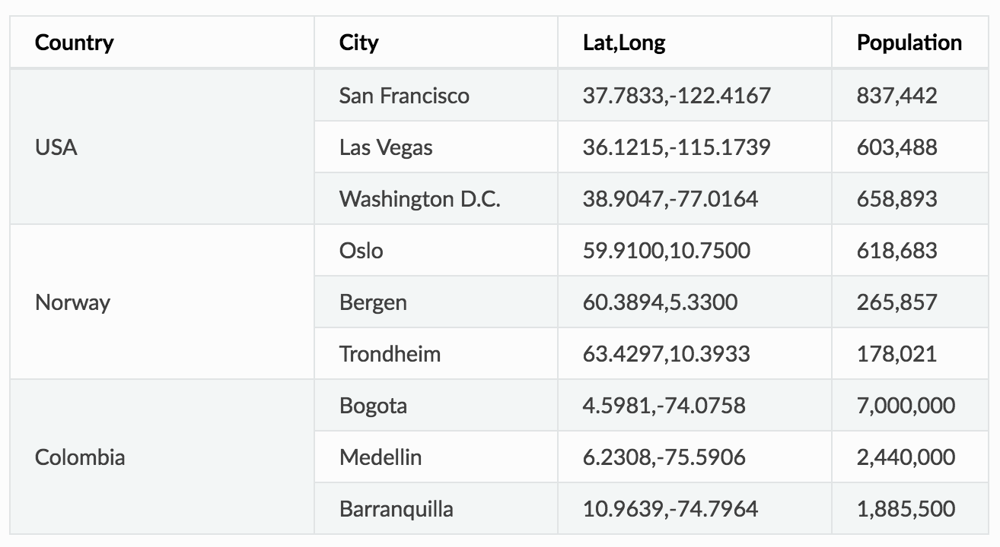

= My first website starter

A step-by-step tutorial for building your first website with Enonic XP

image::images/ready-set-code.jpg["Ready...Set...Code!", width=50%, align="center"]

== Introduction

This guide will take you through the steps of creating a site, using the basic building blocks of Enonic XP.

During this exercise you will learn how to:

* create new project using a starter
* Learn about content types
* Define pages and parts
* TODO more?

== Create and deploy app

Visit the https://developer.enonic.com/start[Getting started guide]

NOTE: If you have already installed CLI, you may skip step 1 in the "getting started guide"

. Complete each step in the guide, but remember to choose "My First Website" in step 2

NOTE: Remember to install the apps from the Welcome tour, as we will need Content Studio later on. If XP tour does not start automatically, simply click the top left icon on the home screen

You should now have an XP sandbox and the application running on http://localhost:8080

[NOTE]
====
To verify that your app started successfully, you should find an entry similar to this in the sandbox log:

  2019-04-09 13:40:40,765 INFO ... Application [<my.project.name>] installed successfully
====

== Content Studio

We're now ready to start building our site.
To launch `Content Studio`, simply select it from the main menu.

NOTE: If you cannot see Content Studio in the menu, it has not been installed. Install it by completing the Welcome tour (Icon on home screen).

For convenience, the starter includes the `Hello World` sample site with some sample countries and city content items.

You should see the following:

TODO Image

==== Site descriptor

An application can serve many purposes and building sites is just one of them. The `site.xml` file is the descriptor that will let *Enonic
XP* know that this app can be added to a site. Response filters and controller mappings can be set up in the site descriptor as well as
application configurations (see http://docs.enonic.com/en/stable/developer/site/site.html#site-descriptor[Site descriptors]).

A basic `site.xml` file was automatically created by the `init-project` script and we don't need to make any changes for now. Later in this
tutorial we will edit `site.xml` to add a site-wide configuration.

  [project-root]/src/main/resources/site/site.xml

==== Application description and icon

The `application.xml` file at `[project-root]/src/main/resources/application.xml` can be edited to provide a suitable description for
your app. Go ahead and give your app a custom description.

The `application.svg` file can be replaced with a custom app icon. The description and icon will be visible in the admin tools.

NOTE: Most of the files we will be working with are inside the "site" directory in the project folder - `src/main/resources/site. All file
  paths from now on will begin with `site/`.

==== Page Component

Page components are the most basic building blocks of websites in *Enonic XP* (see http://docs.enonic.com/en/stable/developer/site/page/index.html#page[Page]). They require a JavaScript
controller and optionally an XML descriptor and an HTML view. This first example does not need a descriptor file.

A page controller (see http://docs.enonic.com/en/stable/developer/site/page/index.html#page[Page]) is a JavaScript file that handles requests such as *GET* and *POST*.
Controllers usually pass data in the form of a JavaScript object to be dynamically rendered in an HTML view. No data is passed in the
example below, but the view file is specified and rendered as static HTML.

. Create a folder called `hello` inside the `site/pages` directory.

. Create the page controller and page view files specified below inside the `hello` folder:
+
[source,javascript]
----
include::../src/main/resources/site/pages/hello/hello.js[]
----
+

The `view`  below is a simple HTML file. This file will be updated later to handle dynamic content.

+
[source,HTML]
----
include::../src/main/resources/site/pages/hello/hello.html[]
----
+

. Once these files are in place, redeploy the app from the terminal with `./gradlew deploy`.

NOTE: Each page controller must reside in its own folder under the `site/pages` directory. The name of the controller JavaScript file
  must be the same as the directory that contains it. The HTML view file can reside anywhere in the project and have any valid file name.
  This allows view files to be shared between components.

==== Create Site

Now that the files are in place, we can create the site in a browser using the Content Studio admin tool.
Switch between different tools by clicking the image:images/icon-menu.png[Menu icon, 30] menu icon (top right) to open the Launcher panel.

. In your browser, navigate to the *Content Studio* tool. (Use the menu icon at the top right)
. Click *New* and select *Site* from the list of content types (Opens a tab for editing the new site).
. Fill in the form with *Display Name*: _Hello World_.
. Select your *MyApp* application in the *Applications* dropdown.
. If you don't see a blue area on the right of the page then click image:images/icon-monitor.png[Menu icon, 30] button in the toolbar to open the *Page Editor*.
. Use the dropdown in the *Page Editor* (blue area) to select the "_hello_" page.
. Click the *Save draft* button in the toolbar (top-left).
. Now close the *Hello World* site editor tab to see the content pane.

When you click on the *Hello World* site content, the preview should look something like this:

image::images/hello-world-site1.jpg["Hello World site", width=90%, align="center"]

****
This concludes part one of the tutorial.

*Let's review:*

You've learned how to initialize a new project with the CLI toolbox init-project.

Then you set the `$XP_HOME` environment variable and deployed the app with gradle.

Next, you created a page component with a JavaScript
controller and an HTML view file.

Finally, you created a site in the Content Studio and added the app and page component to the site.

This might seem like a lot of work just to make a static page; but we have laid a solid foundation in preparation for dynamically displaying
structured content in reusable components which you will learn about in the next section.

****

== Part 2: Content types and parts

****
Now it is time to introduce content types for structured data and how to display the data with part components. You will also learn how to build pages and page templates with components and regions.
****

=== Add some Countries

In order to make our `World` slightly more interesting, we will add some countries as structured data.

The structure of data (such as countries) are defined in XML files and are referred to as _Content Types_. The content type defines the form (and underlying schema) of items you manage.

. Create a folder named “_country_” inside the “_content-types_” folder of your project.
. Create an XML file named “_country.xml_” in the “_country_” folder and paste in the code below for the `Country` content type.

+
.Country content type:
[source,XML]
----
include::../src/main/resources/site/content-types/country/country.xml[]
----
+

Each content type can have a custom icon that will be visible in the *Content Studio* interface. Though not required, content icons can be helpful for content editors.

. Copy the image below to the the same folder (`content-types/country`) with the name _country.png_.

image::images/country.png["Country content type", width=100, align="center"]

This content type defines form inputs for _description_ and _population_. Every content has a built-in field for _Display Name_. When the app is redeployed, you can create a new content of type *Country* in the *Content Studio*. The *Country* content type will produce the form seen below. Each country content that is created with this form will become a page in the site when a page component is added to it with the dropdown in the page editor on the right. More on this later.

image::images/country-content-form.jpg["Country Content form", width=90%, align="center"]

NOTE: Each content type must reside in its own folder under the `site/content-types` directory. The name of the content type XML file and the icon PNG file must be the same as the directory that contains them.

=== Create the Country Part

We also need a way to display the data from our *Country* content type. This time, rather than making another page controller, we will create a http://docs.enonic.com/en/stable/developer/site/part/index.html#part[Part] component. *Parts are reusable components* that can be added to _regions_ in pages or layout components - more on this later.

. Create a folder called _country_ inside the _parts_ folder in your project.
. Add the part controller and view files inside the _country_ folder:

+
.Country part controller:
[source,Javascript]
----
include::../src/main/resources/site/parts/country/country.js[]
----
+

The part controller file above handles the *GET* request and passes the country content data to the view file which is shown below.

+
.Country part view:
[source,HTML]
----
include::../src/main/resources/site/parts/country/country.html[]
----
+

=== The Hello Region Page

Parts start to make sense when placed into a _region_. Regions are “slots” contained within pages or layouts. Pages and layouts may contain multiple regions, and each region must have a unique name.

Let’s create a new page component with a single region called _Main_. Later we will use the *Content Studio* to place the _Country_ part into this region.

The benefit of a region (see http://docs.enonic.com/en/stable/developer/site/page/index.html#apps-page-regions[Regions]) is that a page component can be re-used across multiple different pages by simply adding different parts to them as needed.

. Create a folder called _hello-region_ in your `project’s site/pages/` folder.
. Add the _Hello region_ page descriptor, controller and view files:

+
.Page descriptor:
[source,XML]
----
include::../src/main/resources/site/pages/hello-region/hello-region.xml[]
----
+

The XML file above is a http://docs.enonic.com/en/stable/developer/site/page/index.html#apps-page-descriptor[Descriptor]. Regions and page configurations can be defined here.

+
.Page controller:
[source,Javascript]
----
include::../src/main/resources/site/pages/hello-region/hello-region.js[]
----
+

This page controller uses a portal library (see `lib-portal` in http://docs.enonic.com/en/stable/reference/libraries/index.html#js-libraries[Javascript Libraries]) to get the content and extract the _main_ region which was defined in the descriptor XML file.

+
.Page view:
[source,HTML]
----
include::../src/main/resources/site/pages/hello-region/hello-region.html[]
----
+

The view file above defines the place on the page where the region will render component parts that are dragged and dropped in the *Page Editor*.

. When done - redeploy your app once again!

  ./gradlew deploy

NOTE: You can restart XP in http://docs.enonic.com/en/stable/developer/projects/devmode.html#gradle-dev-mode[Development mode] and then the app won’t have to be redeployed after making changes.

=== Add your favorite country

Now that the _Country_ content type is installed (and we have a part to display them), we can create new countries using the *Content Studio* interface.

. Right-click on the _Hello World_ site from the navigation tree and select *New*. The *Create Content* dialogue will open.
. Select _Country_ from the list of content types.
. Fill in the form with the details of your favorite country.

Similar to the site, we must also configure a view for the country

[start=4]
. In the toolbar, in the top right corner of the page, click the image:images/icon-monitor.png[Menu icon, 30] button to activate the *Page Editor* (panel on the right-hand side with blue background).

image::images/country-content-edit.jpg["Country Content form", width=90%, align="center"]

[start=5]
. In the *Page Editor* select _Hello Region_ from the template selector dropdown. If the dropdown arrow is not visible, double-click inside the option field or start typing "_hello world_" in it to see the options.

The blue box with _Drop here_ is the region that we defined in the project code and it’s where we add components here in the *Page Editor*.

[start=6]
. Click the image:images/icon-cog.png[Cog icon, 30] button in the toolbar to open the *Inspection Panel* (far right).
. In the *Inspection Panel*, click the *Insert* tab. This reveals a list of default component types that can be placed into regions.
. Click and drag a new part (image:images/icon-part.png[Part icon, 30]) into the box on the page.
. A new dropdown option will appear. Select the _country_ part.
. Save draft and close the content edit tab.

When you click on the country in the content pane, you should see a preview of the rendered page, something like this:

image::images/country-content-rendered.jpg["Country Content rendered", width=90%, align="center"]

=== The Country Page Template

With our current solution, sadly, we would have to create a new page for every country we add. As this is not a very effective way of working with large data sets, we will create a page template that will automatically render all country content.

. Select the Templates item image:images/icon-templates.png[Templates icon, 30] located below the _Hello World_ site in the content panel.
. Click *New* and select _Page Template_.
. Fill in the form as follows:

:: . Display Name: _Country_
:: . Supports: _Country_ (select from the list of content types)

. If the blue *Page Editor* panel is not displayed on the right, click the image:images/icon-monitor.png[Menu icon, 30] button in the toolbar.
. Select the _Hello Region_ controller with the dropdown in the blue *Page Editor* panel.
. Open the *Inspection Panel* (activated with the image:images/icon-cog.png[Cog icon, 30] button in the toolbar).
. Under the _Insert_ tab, drag and drop a new _part_ (image:images/icon-part.png[Part icon, 30]) into the empty region where it says _Drop here_.
. Select the _country_ part from the dropdown.
. Click _Save draft_ in the toolbar and close the tab.

Every _Country_ content you create from now on will use this template by default.

NOTE: The *Supports* property is the key. A page template will support rendering of the content types specified here.

Try this out by creating a few new countries in your site. Be aware that every content you create will be a child of the content that was selected in the content pane, so make sure you select the _Hello World_ site before clicking *New* in the toolbar. Or better yet, get in the habit of right-clicking the desired parent content and selecting *New* from the context menu. This way you will never accidentally create a content in the wrong place.

NOTE: Starting from *Enonic XP 6.11*, the *Detail Panel* on the far right of the *Browse View* has a little box showing the rendering mode. Compare your favorite country to other countries that are rendered automatically:

image::images/rendering-mode-view.png["Rendering mode", width=90%, align="center"]

=== Extra task

*Make your Favorite Country use the page template too!*

You might remember that your favorite country was “hardcoded” - so let’s change it to use templates as well.

. In the *Browse View* panel, double-click the country content to edit it.
. Open the *Inspection Panel* with the image:images/icon-cog.png[Cog icon, 30] button and select the *Inspect* tab if it’s not already selected.
. You should see a label for *Page Template* with _Custom_ selected and a label for *Page controller* with _Hello Region_ selected. If you see a label for *Part* instead then click on the page above the country name to select the page. Then click the *Inspect* tab. (See image below)
. Now select _Automatic_ from under the *Page Template* label in the *Inspect* tab.
. Save draft and close the tab.

image::images/page-template-automatic.jpg["Automatic Page Template", width=90%, align="center"]

You can select another *Page template* at any time, or even customize the presentation of a single content.

== Part 3: Configurable components

****
Welcome to part three. Here we will create a new content type for cities and a configurable component to display them. You will also learn how to make app configurations and you will get more practice with the *Content Studio*. Part three will conclude with content publishing and some advice and best practices.
****

=== Hello Geo World

The home page of the site now shows a list of the countries we have added. To make this even more exciting, we will add a _City_ content type with geo-location and a _City list_ part with configuration capabilities.

==== City content

The next steps will create a content type for adding cities with location coordinates.

. Create a folder named city inside the project’s ``site/content-types`` folder.
. Add the content type file below to your project. The file must be named `city.xml`, in accordance with the content type’s folder name (`city`).

+
.City content type:
[source,XML]
----
include::../src/main/resources/site/content-types/city/city.xml[]
----
+

The file above defines a content type for cities with a required field for the location in latitude and longitude.

. Copy the image below and save it in the same folder with the _City_ content type. Name it _city.png_.

image::images/city.png["City content type", width=100, align="center"]

==== City list part

We need a part component to display the city data. It will list the cities and show a Google map of each location.

. Create a folder named `city-list` inside the project’s `site/parts` folder.
. Add the part descriptor file. It must be named `city-list.xml`.

+
.City list part descriptor:
[source,XML]
----
include::../src/main/resources/site/parts/city-list/city-list.xml[]
----
+

The part descriptor above has a configuration similar to those found in content types.

. Add the part controller file. It must be named `city-list.js`.

+
.City list part controller:
[source,Javascript]
----
include::../src/main/resources/site/parts/city-list/city-list.js[]
----
+

There are a few things to note in this controller file. It gets the part configuration for zoom and map type which were defined in the part descriptor. It also gets the site configuration for the *Google Maps API* key which we will define later in the `site.xml` file. *Page Contributions* are used to put the *Google Maps* JavaScript into the head of the document.

. Add the part view file. It must be named `city-list.html` to match the `resolve` function in the controller.

+
.City list part view:
[source,HTML]
----
include::../src/main/resources/site/parts/city-list/city-list.html[]
----
+
There is just one more file to edit and then all the code for this project will be complete.

=== App configuration

*Google Maps* won’t work without an API key. We need somewhere to enter the key so that it can be accessed by any component that needs it. The perfect place to define a site-wide configuration is in the site descriptor.

. Replace the contents of the `site.xml` file at `site/site.xml` with the code below.
+
.Site descriptor:
[source,XML]
----
include::../src/main/resources/site/site.xml[]
----
+

The inputs defined in the site descriptor will appear in a form when editing the site content in the *Content Studio*.

. If you didn’t start XP in http://docs.enonic.com/en/stable/developer/projects/devmode.html#gradle-dev-mode[Development mode] then build and deploy your project one final time with `./gradlew deploy`.

All of the project’s files are now complete. The rest of the steps will be performed in the *Content Studio* interface.

[start=3]
. Edit the site content. You will notice that the `Myapp` application is now red due to a missing required configuration.
. Click the pencil icon to edit the `Myapp` configuration and enter your *Google API* key. You can get a *Google API* key from the Google developers site if you don’t already have one.

image::images/app-config.jpg["Myapp config", width=90%, align="center"]

=== Create Cities

Now let’s make use of the new city content type and part component. First we need to add the `City list` part to the `Country` page template.

. Edit the `Country` page template. Find it in the content pane below the templates image:images/icon-templates.png[Templates icon, 30]
. Open the *Inspect Panel* by clicking the image:images/icon-cog.png[Inspect panel, 30] button in the toolbar.
. Under the *Insert* tab, click and drag a _Part_ image:images/icon-part.png[Part, 30] to the page region below the _country_ part. (This may be a bit tricky because the _country_ part is small.) You could also right-click on the word _Country_ and then use the context menu to insert the part.
. Select the _City list_ part from the dropdown in the box.
. Save and close the tab.

Now we need to create a few _City_ contents under each country. (Sample data is available in the table below.)

. From the content pane, select a country content that you created earlier. It is important that each city content is created under its country.
. Right-click the country content and select *New*. The *Create content* dialogue will open.
. Now select _City_ from the list of content types.
. Fill in the city name and location; the population is optional. The location format must be comma separated latitude and longitude with decimals.
. Save draft.
. Create several more city contents below each country content by repeating the previous steps. Sample data is provided in the table below.

Each country page will now have a list of the cities you created with a Google map of the location. It should look something like this:

image::images/city-list.png["City list", width=90%, align="center"]

=== Configure City List

The _City list_ part descriptor (`site/parts/city-list/city-list.xml`) has configuration inputs for the map type and zoom level. You can set the default values for these inputs by editing the `City list` part in the `Country page` template.

. Open the _Country page_ template for editing.
. Open the *Inspection Panel* by clicking the image:images/icon-cog.png[Inspect panel, 30] button in the toolbar.
. Click on the _City list_ part in the *Page Editor* panel.
. Under the *Inspect* tab of the *Inspection Panel*, set the Map type to _HYBRID_ and Zoom level to _12_.
. Save draft and close the edit tab.

Now all of the countries will show the city maps with the new settings. You can override these defaults for any individual country by editing the _Country_ content and changing its _City list_ part configuration.

image::images/city-list-config.jpg["City list", width=90%, align="center"]

=== Go Online

Now that your _Hello World_ site is complete, it’s time to publish.

. Select the _Hello World_ site in the content browse panel
. Right-click and select *Publish* from the context menu, or click the *Publish* button in the toolbar
. The *Publishing Wizard* will appear. You may click the image:images/icon-children.png[Child items, 30] icon to see all child nodes that will also be published.
. Verify that all your items are listed and click *Publish*!

When publishing content, all the selected items and changes are “cloned” from *draft* to the *master* branch (http://docs.enonic.com/en/stable/developer/node-domain/repository.html#node-domain-repository[Repository]).

You will always see the draft version of content in the preview panel and the *Page Editor* of the *Content Studio*. If you have placed your site on root level, you can also see your live site at this url: `http://localhost:8080/portal/master/hello-world`.

Well done, you have just created *your first site for Enonic XP*! The Enonic team congratulates you - we look forward to seeing all the brilliant things you will make.

We are always looking for https://discuss.enonic.com/[feedback].

Now take a look at some Pro Tips.

=== Pro Tips

==== Adding libraries to your project

Why re-invent the wheel for each app you make? Reusable code can be created in libraries and added to any XP project. Some essential tools can be found in the https://github.com/enonic/lib-util[Util lib], https://github.com/enonic/lib-menu[Menu lib], https://github.com/enonic/lib-recaptcha[RECAPTCHA] and https://github.com/enonic/lib-landingpage[Landing page] libraries.

==== Adding apps to your site

A website can be created from a single app. But a site’s functionality can be extended by adding other pre-made apps. SEO Meta Fields, Disqus comments and Google Analytics are just a few of the many apps that can instantly add features to your site. See what’s available at the http://market.enonic.com/applications[Enonic Market].

==== Handling Multiple projects

A *best practice* for working on multiple projects would involve keeping a separate `XP_HOME` folder for each project. The folder structure for such a setup would look something like this:

    /Users/<name>/development
    /Users/<name>/development/software/<xp-install-version>
    /Users/<name>/development/xp-homes/<project-name>/home
    /Users/<name>/development/projects/<project-name>/<project-source-files>

An actual implementation with projects called my-first-app and company-site would look like this:

    /Users/mla/development/software/enonic-xp-6.14.1
    /Users/mla/development/xp-homes/my-first-app/home
    /Users/mla/development/xp-homes/company-site/home
    /Users/mla/development/projects/my-first-app/...
    /Users/mla/development/projects/company-site/...

This allows you to have one *Enonic XP* installation for each version and as many different `XP_HOME` folders as you need for your projects. When switching from one project to another, you only have to change the `XP_HOME` environment variable and then restart the installation of the *Enonic XP* version that the project was created for.

Check this http://labs.enonic.com/articles/working-with-multiple-xp-projects[Enonic Labs article] for a more in-depth process. It also includes some bash scripting that will help with setting and changing `$XP_HOME` and starting and stopping *XP*.

==== Logging JSON objects

While developing an app, it can be helpful to see the structure of objects returned by library functions. The best way to do this is to set up a utilities JavaScript file in the project lib folder. Add the following function to the utilities file:

    site/lib/utilities.js

    exports.log = function (data) {
      log.info('Utilities log %s', JSON.stringify(data, null, 4));
    };

Call the log function in any controller like the example below and then check the log after refreshing the page.

    var util = require('utilities');

    var content = portal.getContent();
    util.log(content);

This logging function and many other useful functions are included in the https://github.com/enonic/lib-util[Util library].

==== Continuous build with Dev Mode or Gradle

It can be quite time consuming to frequently use the terminal to redeploy an app during development. Starting *Enonic XP* in _dev-mode_ will make most changes to your app code visible immediately on _localhost_. See the http://docs.enonic.com/en/stable/developer/projects/devmode.html#gradle-dev-mode[Development mode] page for more information about its capabilities and limitations.

Another option is to use `./gradlew -t deploy` in the terminal from the project root. This will automatically build and redeploy your app every time changes to a file are detected. This method is slower than dev-mode, but it handles some situations that dev-mode doesn’t. *Gradle 2.7* or newer is required.

Both dev-mode and Gradle continuous-mode require the `$XP_HOME` environment variable to be set in the terminal window.

== Next Steps

This tutorial only covered the basics of app development. Explore the documentation for more in-depth coverage.

Check our https://github.com/enonic[GitHub] page for examples of more advanced apps. The https://github.com/enonic/app-superhero-blog[Superhero blog] app is also a good place to see more advanced code. The https://github.com/enonic/app-google-analytics[Google Analytics] app demonstrates extending the *Content Studio* interface.

The HTML files in this tutorial used *Thymeleaf* for dynamic data. Visit the http://www.thymeleaf.org/documentation.html[Thymeleaf documentation] to learn more about it.

Need help? Ask questions on our https://discuss.enonic.com/[forum] or answer questions from others.
